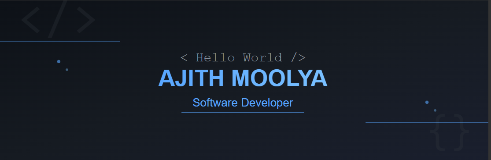

# 💫 About Me

🎓 Recently **graduated in Robotics and AI** from **NMAMIT**  
💻 Passionate **MERN Stack & Full Stack Developer** building **AI-powered web and mobile applications**  
📱 Experienced in developing **Web (React)** and **Mobile Apps (React Native)**  
⚡ Hands-on experience in **MERN Stack, AI, and Application Development**  
🤝 Open to collaborating on **AI-integrated full stack projects**  
💬 Ask me about **MERN Stack, React Native, AI Integration, and Full Stack Development**

🌐 **Portfolio:** https://ajithmoolya.vercel.app/  

## 🌐 Socials:
 

## 💻 Tech Stack

### 🖥️ Programming Languages  
        

### 🌐 Web & Full Stack Development (MERN)  
            

### 📱 Mobile App Development  
  

### 🤖 AI Tools & Frameworks  
                        

# 📊 GitHub Stats:
  

---

<!-- Proudly created with GPRM ( https://gprm.itsvg.in ) -->
